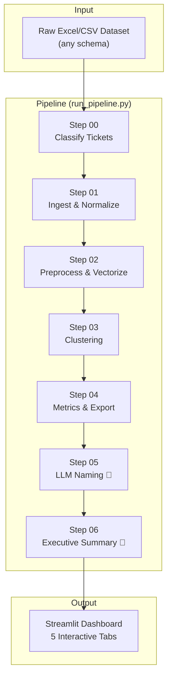
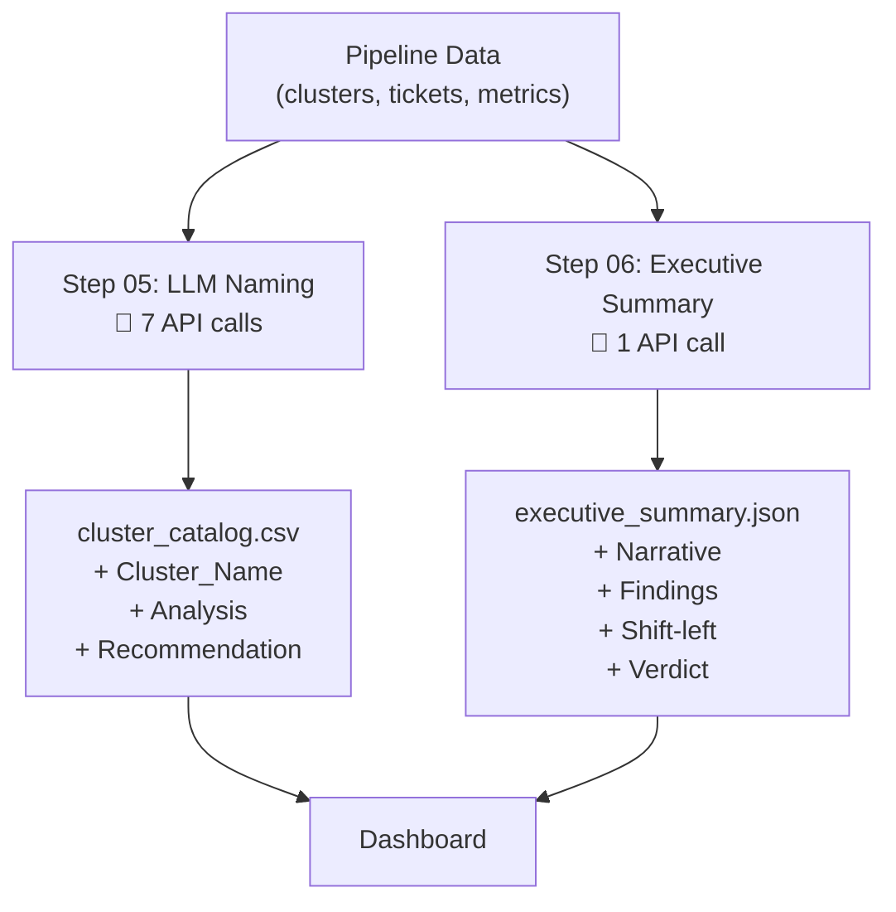

# Legacy vs DBB Ticket Pattern Mining — Complete Application Reference

> **Use Case 5**: Mine historical tickets from Legacy and DBB systems to identify recurring patterns, systemic issues, and opportunities to reduce future ticket volumes.

---

## Table of Contents
1. [Architecture Overview](#architecture-overview)
2. [Pipeline Flow Diagram](#pipeline-flow-diagram)
3. [Step-by-Step Breakdown](#step-by-step-breakdown)
4. [Metrics & KPIs Calculated](#metrics--kpis-calculated)
5. [LLM Integration Points](#llm-integration-points)
6. [Data Flow & File Map](#data-flow--file-map)
7. [How It Maps to Use Case 5](#how-it-maps-to-use-case-5)
8. [Running a New Dataset](#running-a-new-dataset)

---

## Architecture Overview



The pipeline is **7 sequential steps** orchestrated by [run_pipeline.py](file:///c:/Users/yaswa/OneDrive/Desktop/Projects/DBB%20VS%20Legacy/run_pipeline.py). Each step reads from the previous step's output and writes to the next. **Two steps** (05 and 06) make external LLM API calls via Groq.

---

## Pipeline Flow Diagram


---

## Step-by-Step Breakdown

### Step 00: Classify Tickets
**Script**: [00_classify_tickets.py](file:///c:/Users/yaswa/OneDrive/Desktop/Projects/DBB%20VS%20Legacy/src/00_classify_tickets.py)
**Input**: Raw Excel or CSV file (any column names)
**Output**: `data/processed/classified_tickets.xlsx` (2 sheets)

**What it does:**

1. **Heuristic Column Mapping** — Uses regex patterns to auto-detect which column means what. For example:
   - `"ticket.*id|incident.*id"` → maps to `Number`
   - `"assignment.*group|resolver.*group"` → maps to `Assignment group`
   - This means you can feed it datasets from ServiceNow, Jira, Remedy — it adapts.

2. **5-Tier Classification** — Assigns `System_Type` (Legacy/DBB/Both/Unknown) and `System_Subtype` (e.g., DBB-OTD, Legacy-SAP):

   | Priority | Field Used | Confidence | Example |
   |----------|-----------|------------|---------|
   | **Tier 1** | Configuration Item | 1.00 | `"otd production"` → DBB-OTD |
   | **Tier 2** | Service Offering | 0.95 | `"glassrun"` → DBB-OTD |
   | **Tier 3** | Assignment Group | 0.85 | `"tiger tribe"` → DBB-OMNI |
   | **Tier 4** | Business Service | 0.70 | `"market to order"` → DBB-Other |
   | **Tier 5** | Text Signatures | 0.60 | `"glassrun"` in description → DBB-GlassRun |

3. **Post-Migration Noise Detection** — Tickets reopened within 90 days of the first DBB ticket are flagged as `post_migration_noise = True`.

4. **Unknown Review Queue** — Tickets that couldn't be classified are written to a separate Excel sheet for SME review.

---

### Step 01: Ingest & Normalize
**Script**: [01_ingest_normalize.py](file:///c:/Users/yaswa/OneDrive/Desktop/Projects/DBB%20VS%20Legacy/src/01_ingest_normalize.py)
**Input**: `classified_tickets.xlsx`
**Output**: `data/processed/tickets.parquet`

**What it does:**

Transforms the classified data into a **23-column canonical schema** stored as Parquet:

| Field | Source | Computation |
|-------|--------|-------------|
| `Ticket_ID` | `Number` column | Direct |
| `System_Type` | From Step 00 | Legacy / DBB / Both / Unknown |
| `System_Subtype` | From Step 00 | e.g., DBB-OTD, Legacy-SAP |
| `Domain` | `Business service` | Direct mapping |
| `Module` | `System_Subtype` | Same as subtype |
| `OpCo` | `Impacted OpCo` | Operating company |
| `Created_Date` | `Created` | Parsed to datetime |
| `Closed_Date` | `Closed` | Parsed to datetime |
| `Severity` | `Priority` | Mapped: "1-Critical"→4, "4-Low"→1 |
| `Time_to_Resolve` | Computed | `(Closed_Date - Created_Date)` in hours |
| `Reopen_Count` | `Reopen count` | Integer |
| `Reopen_Flag` | Computed | `True` if `Reopen_Count > 0` |
| `Days_from_Migration` | Computed | Days since first DBB ticket per module |
| `Week` / `Month` | Computed | Period aggregation helpers |

---

### Step 02: Preprocess & Vectorize
**Script**: [02_preprocess_vectorize.py](file:///c:/Users/yaswa/OneDrive/Desktop/Projects/DBB%20VS%20Legacy/src/02_preprocess_vectorize.py)
**Input**: `tickets.parquet`
**Output**: `data/processed/tickets_vectorized.parquet`

**What it does:**

1. **Text Cleaning** — Strips HTML tags, URLs, IP addresses, phone numbers, normalizes whitespace.
2. **Error Code Extraction** — Regex-captures error codes like `ERR-1234`, `exception`, HTTP codes.
3. **Lemmatization** — Uses spaCy `en_core_web_sm` to reduce words to root forms (`running` → `run`).
4. **Semantic Vectorization** — Uses `SentenceTransformer('all-mpnet-base-v2')` to encode each ticket's `Clean_Text` into a **768-dimensional vector**. This is the most compute-intensive step (~10 min for 1,424 tickets).

> [!NOTE]
> The embedding model `all-mpnet-base-v2` is one of the highest quality general-purpose sentence encoders. It captures semantic meaning — two tickets saying "Glassrun won't sync" and "GR synchronization failure" will have very similar vectors even though the words are different.

---

### Step 03: Clustering
**Script**: [03_clustering.py](file:///c:/Users/yaswa/OneDrive/Desktop/Projects/DBB%20VS%20Legacy/src/03_clustering.py)
**Input**: `tickets_vectorized.parquet`
**Output**: `data/processed/tickets_clustered.parquet` + `data/output/cluster_catalog.csv`

**What it does:**

1. **HDBSCAN Clustering** — Density-based clustering on the 768-dim embeddings.
   - `min_cluster_size=15`: Minimum 15 tickets to form a cluster.
   - `min_samples=5`: Core point density threshold.
   - Tickets that don't fit any cluster are labelled `Cluster_ID = -1` (noise).

2. **TF-IDF Keywords** — For each cluster, runs TF-IDF on the lemmatized text and extracts the top 5 keywords.

3. **Cohesion Scoring** — Computes average pairwise cosine similarity within each cluster. Higher = tighter cluster.

**Preliminary catalog output:**

| Column | Meaning |
|--------|---------|
| `Cluster_ID` | Integer identifier |
| `Size` | Number of tickets |
| `Top_Keywords` | Top 5 TF-IDF terms |
| `Primary_Domains` | Top 2 business domains represented |
| `Cohesion_Score` | 0-1 (how semantically similar the tickets are) |

---

### Step 04: Metrics & Export
**Script**: [04_metrics_export.py](file:///c:/Users/yaswa/OneDrive/Desktop/Projects/DBB%20VS%20Legacy/src/04_metrics_export.py)
**Input**: `tickets_clustered.parquet` + `cluster_catalog.csv`
**Output**: `cluster_catalog.csv` (enriched) + `data/output/legacy_vs_dbb_pivot.csv`

**What it does:**

Calculates the **business KPIs per cluster** that power the dashboard:

| Metric | Formula | What It Tells You |
|--------|---------|-------------------|
| `Frequency_Legacy` | Count of Legacy tickets in cluster | How bad was this in Legacy? |
| `Frequency_DBB` | Count of DBB tickets in cluster | Did it survive into DBB? |
| `Reduction_Rate` | `1 - (Freq_DBB / Freq_Legacy)` | Did DBB fix it? (1.0 = eliminated, negative = worse) |
| `Impact_Legacy` | `Freq_Legacy × Avg_Severity` | Weighted business impact in Legacy |
| `Impact_DBB` | `Freq_DBB × Avg_Severity` | Weighted business impact in DBB |
| `AvgTTR_Delta_Hours` | `Avg_TTR_DBB - Avg_TTR_Legacy` | Is DBB faster to resolve? (negative = faster) |
| `ReopenRate_Delta` | `Reopen%_DBB - Reopen%_Legacy` | Are DBB fixes sticking? (negative = better) |
| `PostMigrationNoiseFlag` | `True if >20% of cluster is noise` | Should we discount this cluster? |

Also generates a **Domain × Module pivot table** with Legacy vs DBB ticket counts.

---

### Step 05: LLM Naming 🤖
**Script**: [05_llm_naming.py](file:///c:/Users/yaswa/OneDrive/Desktop/Projects/DBB%20VS%20Legacy/src/05_llm_naming.py)
**Input**: `cluster_catalog.csv` + `tickets_clustered.parquet`
**Output**: `cluster_catalog.csv` (enriched with names)

> [!IMPORTANT]
> **This is LLM Call Point #1** — Makes one Groq API call per cluster (7 calls total for current dataset).

**What it does:**

1. **Assigns 5 Strategic Personas** — Selects the most strategically important clusters:

   | Persona | Selection Logic | Why It Matters |
   |---------|----------------|----------------|
   | **The DBB Pollutant** | Lowest `Reduction_Rate` where both Legacy & DBB > 5 | Legacy problem that infected DBB |
   | **The Chronic Defect** | Highest `ReopenRate_Delta` | Tickets that keep getting reopened |
   | **The Automation Goldmine** | Largest cluster by `Size` | High volume = automation ROI |
   | **The New DBB Headache** | `Freq_Legacy = 0`, highest `Freq_DBB` | New problem created by DBB |
   | **The Legacy Anchor** | `Freq_DBB = 0`, highest `Freq_Legacy` | Problem that DBB successfully eliminated |

2. **LLM Call** — For each cluster, sends to Groq:
   - The cluster's `Primary_Domains` and `Top_Keywords`
   - 10 sample `Short_Description` values from actual tickets
   - Asks for a JSON response with:
     - `Cluster_Name`: 3-6 word human-readable name
     - `Analysis`: 1-sentence root cause explanation
     - `Recommendation`: 1-sentence prevention/automation strategy

**Model**: `llama-3.1-8b-instant` via Groq API
**Temperature**: 0.3 (low creativity, high consistency)
**Response format**: Enforced JSON mode

---

### Step 06: Executive Summary 🤖
**Script**: [06_executive_summary.py](file:///c:/Users/yaswa/OneDrive/Desktop/Projects/DBB%20VS%20Legacy/src/06_executive_summary.py)
**Input**: `cluster_catalog.csv` + `tickets_clustered.parquet`
**Output**: `data/output/executive_summary.json`

> [!IMPORTANT]
> **This is LLM Call Point #2** — Makes exactly **1 Groq API call** with the entire dataset context.

**What it sends to the LLM:**
- Total ticket counts (Legacy vs DBB)
- Reopen rates comparison
- Monthly volume trend (last 12 months)
- Tickets by Domain × System breakdown
- Severity distribution
- Full cluster analysis from Step 05

**What the LLM returns (JSON):**

| Key | Type | Purpose |
|-----|------|---------|
| `executive_narrative` | String | 3-paragraph C-level summary |
| `key_findings` | Array of 5 | Title + detail + impact rating per finding |
| `shift_left_opportunities` | Array of 3 | Pattern + strategy + estimated % reduction |
| `legacy_to_dbb_verdict` | Enum | `DBB_REDUCED_ISSUES` / `DBB_INCREASED_ISSUES` / `MIXED_RESULTS` |
| `domain_health` | Array | Per-domain verdict: improved/worsened/stable/new_in_dbb |

---

## Metrics & KPIs Calculated

### Per-Cluster Metrics (from Step 04)

| KPI | Computed In | Used In Dashboard |
|-----|-----------|-------------------|
| Frequency (Legacy/DBB) | `04_metrics_export.py` | Pattern Discovery, Cluster Deep-Dive |
| Reduction Rate | `04_metrics_export.py` | Remediation Strategy |
| Impact Score | `04_metrics_export.py` | Executive Summary ranking |
| TTR Delta | `04_metrics_export.py` | Cluster Deep-Dive |
| Reopen Rate Delta | `04_metrics_export.py` | Domain & Severity tab |
| Cohesion Score | `03_clustering.py` | Internal quality check |

### Global Metrics (from Step 06)

| KPI | Computed By | Used In Dashboard |
|-----|-----------|-------------------|
| Overall Legacy→DBB Verdict | LLM (Step 06) | Sidebar badge |
| Per-Domain Health | LLM (Step 06) | Domain & Severity tab |
| Shift-Left Estimated Reductions | LLM (Step 06) | Remediation Strategy tab |
| Monthly Volume Trend | Dashboard (live) | Migration Timeline tab |
| Severity Distribution | Dashboard (live) | Domain & Severity tab |
| Reopen Rate Comparison | Dashboard (live) | Domain & Severity tab |

---

## LLM Integration Points



| LLM Call | Script | # of Calls | Model | What Goes In | What Comes Out |
|----------|--------|-----------|-------|-------------|---------------|
| **Cluster Naming** | `05_llm_naming.py` | 1 per cluster (7) | `llama-3.1-8b-instant` | Keywords + 10 sample tickets | Name, Root Cause, Recommendation |
| **Executive Summary** | `06_executive_summary.py` | 1 total | `llama-3.1-8b-instant` | Full dataset statistics | Narrative, Findings, Shift-left, Verdict |

**Total API calls per pipeline run**: ~8 (7 clusters + 1 summary)
**Estimated Groq token usage**: ~4,000 tokens per run

---

## Data Flow & File Map

```
📁 data/
├── 📁 raw/
│   └── Indonesia_Incidents.xlsx          ← Your original dataset
├── 📁 processed/
│   ├── classified_tickets.xlsx           ← Step 00 output (2 sheets)
│   ├── tickets.parquet                   ← Step 01 output (23 canonical columns)
│   ├── tickets_vectorized.parquet        ← Step 02 output (+ embeddings)
│   └── tickets_clustered.parquet         ← Step 03 output (+ Cluster_ID)
└── 📁 output/
    ├── cluster_catalog.csv               ← Steps 03→04→05 (progressively enriched)
    ├── legacy_vs_dbb_pivot.csv           ← Step 04 output
    └── executive_summary.json            ← Step 06 output
```

> [!WARNING]
> **Currently, running a new dataset OVERWRITES the files above.** The old data is lost. See [Running a New Dataset](#running-a-new-dataset) for how to handle this.

---

## How It Maps to Use Case 5

| Requirement | Where It's Addressed | Dashboard Tab |
|-------------|---------------------|---------------|
| Distinguish Legacy vs DBB tickets | Step 00 (5-tier classification) | Migration Timeline |
| Identify overlapping domains/modules | Step 04 (pivot table) | Domain & Severity |
| Where DBB was expected to reduce but didn't | Step 05 (DBB Pollutant persona) | Remediation Strategy |
| Similar issues across different tickets | Step 03 (HDBSCAN clustering) | Pattern Discovery |
| Same functional failures across countries | Step 03 + OpCo field | Cluster Deep-Dive |
| Repeat defects after closure | Step 04 (ReopenRate_Delta) | Domain & Severity |
| Same issue manifesting differently in Legacy vs DBB | Step 05 (per-cluster timeline) | Cluster Deep-Dive |
| Top recurring ticket patterns | Steps 03-05 (clusters + LLM names) | Pattern Discovery |
| Pattern frequency & impact analysis | Step 04 (Impact scores) | Pattern Discovery |
| Legacy vs DBB pattern comparison | Dashboard (per-cluster bar charts) | Cluster Deep-Dive |
| Heatmap of recurring issues | Dashboard (Domain heatmap) | Domain & Severity |
| Pattern → Root Cause → Prevention map | Step 05 (LLM Analysis + Recommendation) | Remediation Strategy |
| Shift-left recommendations | Step 06 (LLM shift-left opportunities) | Remediation Strategy |
| KB / automation opportunities | Step 05 (Automation Goldmine persona) | Remediation Strategy |

### Evaluation Criteria Coverage

| Criteria (Weight) | How We Score |
|-------------------|-------------|
| **Business Impact & Value (25%)** | Per-cluster Impact scores, Reduction Rate analysis, "Where DBB Failed" section |
| **Innovation & AI Usage (20%)** | SentenceTransformer embeddings, HDBSCAN clustering, 2x LLM integration (Groq), Persona-based strategic selection |
| **Feasibility & Technical Soundness (20%)** | Fully working pipeline, Parquet persistence, modular architecture, error handling |
| **Implementation Readiness (20%)** | Single command `run_pipeline.py`, `.env` config, works on any ITSM export |
| **Scalability & Reusability (10%)** | Schema-agnostic column mapper, parameterized scripts, Parquet for large data |
| **Presentation & Clarity (5%)** | 5-tab Streamlit dashboard, LLM-generated executive narrative, emoji-coded verdicts |

---

## Running a New Dataset

### Current behavior
```bash
.venv\Scripts\python.exe run_pipeline.py "path\to\new_dataset.xlsx"
```
This **overwrites** all files in `data/processed/` and `data/output/`.

### To preserve old results
Before running a new dataset, simply copy your current output:
```bash
# Save current results
xcopy data\output data\output_indonesia /E /I
xcopy data\processed data\processed_indonesia /E /I

# Run new dataset
.venv\Scripts\python.exe run_pipeline.py "path\to\malaysia_incidents.xlsx"
```

### Requirements
- `.env` file with `GROQ_API_KEY=gsk_...`
- Virtual environment activated with all dependencies
- ~10 minutes for vectorization (Step 02) on CPU
- ~30 seconds for all other steps combined
